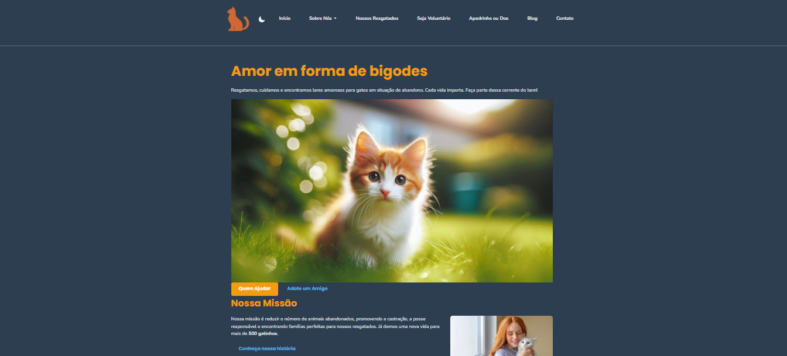

# Projeto Patas de Veludo - Plataforma Web para ONG

Este é o projeto final desenvolvido para a disciplina de Desenvolvimento Front-End do curso de Análise e Desenvolvimento de Sistemas pela Cruzeiro do Sul, que consiste na criação de uma plataforma web completa para uma ONG fictícia de resgate de gatos, a "Patas de Veludo". O projeto abrange desde a estruturação semântica com HTML5 até a interatividade avançada com JavaScript, seguindo as melhores práticas de acessibilidade e design responsivo.

---

### 🐾 Visualização do Projeto Finalizado

## ✨ Funcionalidades Implementadas

* **Design System Completo:** Cores, fontes e espaçamentos definidos com variáveis CSS para consistência.
* **Leiaute Responsivo:** Construído com CSS Grid e Flexbox, se adaptando a desktops, tablets e celulares.
* **Sistema de Grid de 12 Colunas:** Para criação de leiautes complexos e alinhados.
* **Navegação Sofisticada:** Inclui menu hambúrguer para mobile e submenu dropdown para desktop.
* **Modo Escuro (Dark Mode):** Um tema alternativo acessível que persiste entre as sessões.
* **Single Page Application (SPA):** Navegação fluida entre as páginas sem a necessidade de recarregamento, utilizando a History API.
* **Componentes Dinâmicos:**
    * Galeria de gatos carregada dinamicamente a partir de um arquivo JSON.
    * Gráficos de transparência renderizados com a biblioteca Chart.js.
* **Validação Avançada de Formulários:** Verificação de consistência de dados em tempo real com JavaScript.
* **Acessibilidade (WCAG 2.1 AA):** Alto contraste, navegação completa por teclado e uso de atributos ARIA para suporte a leitores de tela.

---

## 🛠️ Tecnologias Utilizadas

* **HTML5** (com foco em semântica e acessibilidade)
* **CSS3** (Variáveis, Grid, Flexbox, Media Queries)
* **JavaScript (ES6+)** (Manipulação do DOM, Módulos, Fetch API, LocalStorage)
* **Bibliotecas Externas:**
    * Chart.js (para os gráficos)
    * IMask.js (para as máscaras de formulário)

---

## 🚀 Como Rodar o Projeto Localmente

1.  Clone este repositório.
2.  Para uma melhor experiência, utilize a extensão **Live Server** no Visual Studio Code.
3.  Clique com o botão direito no arquivo `index.html` e selecione "Open with Live Server".
